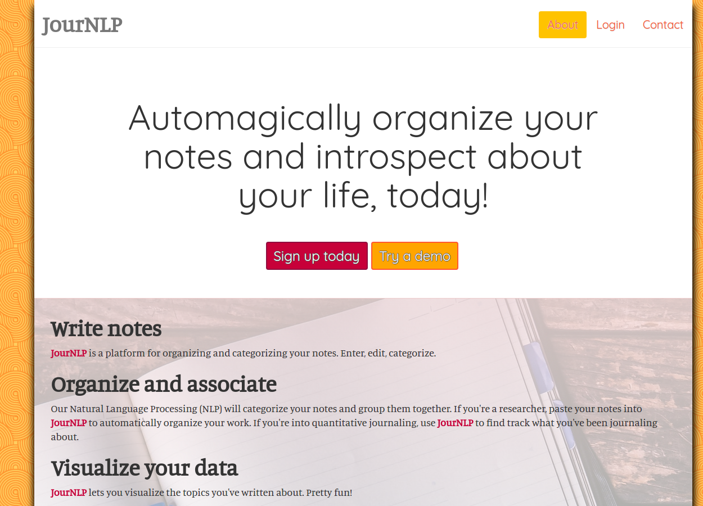
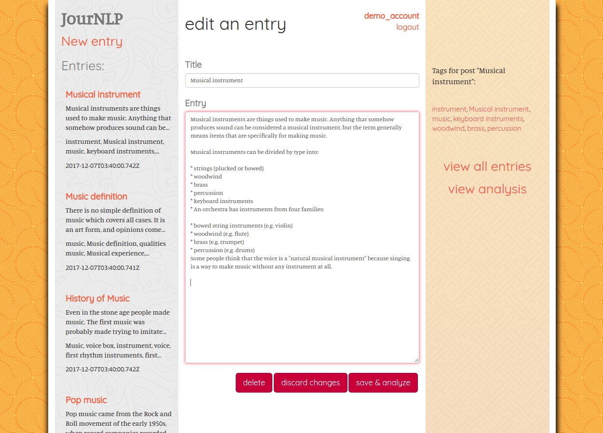

# JourNLP

_JourNLP_ is a journaling/note-taking web app that automatically categorizes your notes for you, using Natural Language Processing. Type in your notes, submit, and _JourNLP_ categorizes them with NLP. Identical topics are grouped together, and data from your notes can be visualized.

#### [Production version, live...here.](https://jour-nlp.herokuapp.com)
---------------------------------------------------------------

## Platforms/libraries/frameworks used
* Express/Node.js
* [Passport](http://passportjs.org/) with [passport-jwt](https://github.com/themikenicholson/passport-jwt), for authentication
* [jwt-simple](https://github.com/hokaccha/node-jwt-simple) for encoding/decoding our JWTs
* [Retext](https://github.com/wooorm/retext/) with [retext-keywords](https://github.com/wooorm/retext-keywords), for our categorization
* MongoDB, with [Mongoose](mongoosejs.com/) for schema, input validation, etc
* [bcryptjs](https://www.npmjs.com/package/bcryptjs) for password hashing & salting
* Mocha and Chai, for our tests
* [Travis-CI](https://travis-ci.org/) for test automation
* [node-cron](https://github.com/kelektiv/node-cron) for periodically refreshing our demo account's data
* jQuery, for our client

Sidebar patterns, courtesy [subtlepatterns.com](http://www.subtlepatterns.com) and [dinpattern.com](http://www.dinpattern.com/).
[Fonts](https://fonts.google.com/) and [data visualization](https://developers.google.com/chart/) courtesy Google.

---------------------------------------------------------------

## API

The API here is RESTful. Most access involves authentication via [JWT](https://jwt.io/introduction/); the exceptions are account creation (`POST /api/user_account`) and log in (`POST /api/log_in`). All request/response bodies are of type `application/json`.

The API endpoints for this project broadly do two things:

1. CRUD notes entries&#8212;that is (1) make posts, (2) access post data, (3) update posts, and (4) delete posts data
2. CRUD user accounts&#8212;i.e., (1) create user accounts, (2) get access to all the data associated with a user account, (3) change a user password, and (4) delete an account and all associated data

### API Endpoints

[API endpoints described here.](doc/API-documentation.md)

---------------------------------------------------------------

## Screenshots

**Splash page**

---------------------------------------------------------------

**Write listings; JourNLP categorizes them**

---------------------------------------------------------------

**Click the categories to view your entries with those same categories**

---------------------------------------------------------------

**View a visual representation of the topics you've written about**

